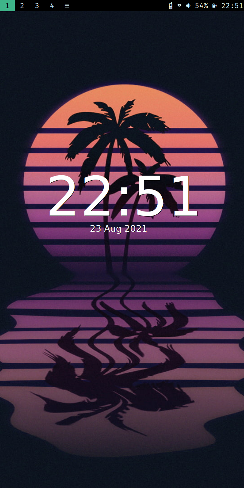
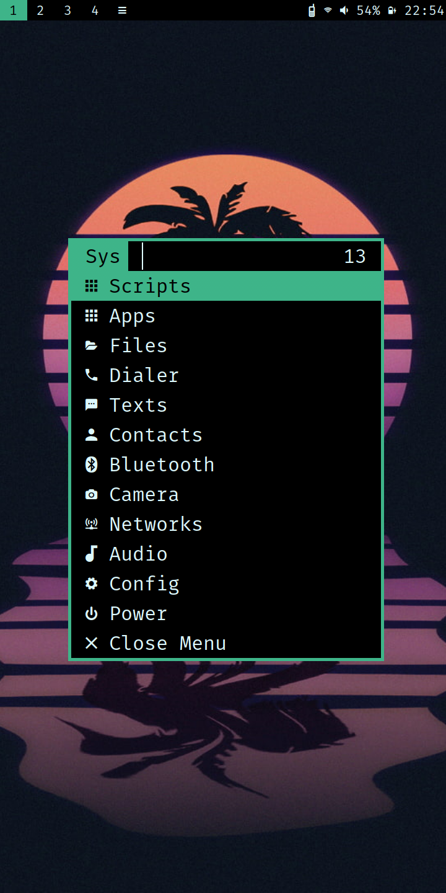

# 1. synth-sxmo
My personal settings for sxmo




# 2. Table of contents
- [1. synth-sxmo](#1-synth-sxmo)
- [2. Table of contents](#2-table-of-contents)
- [3. Notes](#3-notes)
  - [3.1. Install](#31-install)
  - [3.2. .Xresources](#32-xresources)
  - [3.3. Anbox](#33-anbox)
- [4. Resources](#4-resources)
  - [4.1. Sxmo Userguide](#41-sxmo-userguide)
  - [4.2. Sxmo userscripts location](#42-sxmo-userscripts-location)
  - [4.3. Anbox](#43-anbox)
- [5. Credit](#5-credit)

# 3. Notes
## 3.1. Install
```
./install.sh
# Manually move contents of userscripts/ into $XDG_CONFIG_HOME/sxmo/userscripts since user can vary
```

## 3.2. .Xresources
```
mv .Xresources ~/.Xresources
mv background.jpg /usr/share/sxmo/background.jpg
```

## 3.3. Anbox
```
sudo ./anbox-shell.sh # https://raw.githubusercontent.com/anbox/anbox/master/scripts/anbox-shell.sh
# Move apk to /var/lib/anbox/data/media/0/Download
# Apk location in anbox /sdcard/Download/
pm install --user 0 NAME.apk # installs the apk in the adb shell
```

# 4. Resources
## 4.1. Sxmo Userguide
> https://sxmo.org/docs/USERGUIDE.html
## 4.2. Sxmo userscripts location
> $XDG_CONFIG_HOME/sxmo/userscripts/

## 4.3. Anbox
> https://github.com/dreemurrs-embedded/Pine64-Arch/issues/143
> https://raw.githubusercontent.com/anbox/anbox/master/scripts/anbox-shell.sh

# 5. Credit
> https://github.com/justinesmithies/sxmo-alarm
