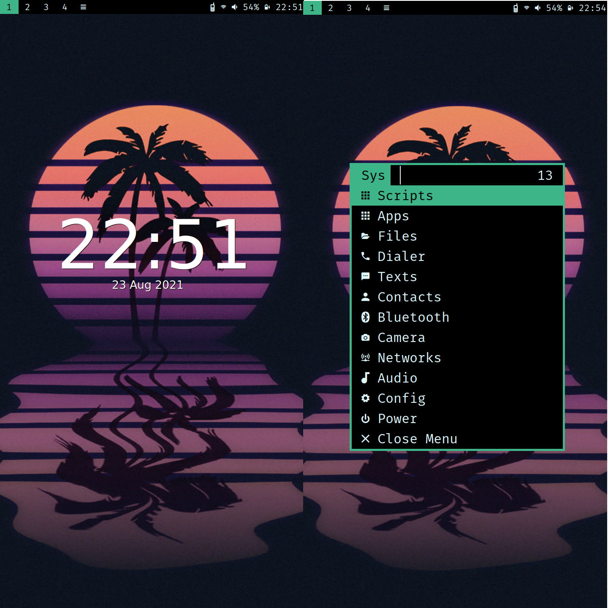

# 1. synth-sxmo
My personal settings for sxmo



# 2. Table of contents
- [1. synth-sxmo](#1-synth-sxmo)
- [2. Table of contents](#2-table-of-contents)
- [3. Notes](#3-notes)
  - [3.1. Install](#31-install)
  - [3.2. Usage](#32-usage)
  - [3.3. anbox.sh](#33-anboxsh)
  - [3.4. anbox-shell.sh](#34-anbox-shellsh)
    - [3.4.1. To install apk via anbox-shell.sh](#341-to-install-apk-via-anbox-shellsh)
- [4. Resources](#4-resources)
  - [4.1. Sxmo Userguide](#41-sxmo-userguide)
  - [4.2. Sxmo userscripts location](#42-sxmo-userscripts-location)
  - [4.3. Anbox](#43-anbox)
- [5. Credit](#5-credit)

# 3. Notes
## 3.1. Install
```
./install.sh
# Manually move contents of userscripts/ into $XDG_CONFIG_HOME/sxmo/userscripts since user can vary
```
## 3.2. Usage
## 3.3. anbox.sh
> Must have anbox and anbox-image installed
> Run the script to start anbox
## 3.4. anbox-shell.sh
> Download from [4.3. Anbox](#43-anbox)
> Must have anbox running
> Run it as root
### 3.4.1. To install apk via anbox-shell.sh
```
# Move apk to /var/lib/anbox/data/media/0/Download
# Apk location in anbox /sdcard/Download/
pm install --user 0 /sdcard/Download/NAME.apk # installs the apk in the adb shell
```

# 4. Resources
## 4.1. Sxmo Userguide
> https://sxmo.org/docs/USERGUIDE.html
## 4.2. Sxmo userscripts location
> $XDG_CONFIG_HOME/sxmo/userscripts/

## 4.3. Anbox
> https://github.com/dreemurrs-embedded/Pine64-Arch/issues/143
> https://raw.githubusercontent.com/anbox/anbox/master/scripts/anbox-shell.sh

# 5. Credit
> https://github.com/justinesmithies/sxmo-alarm
